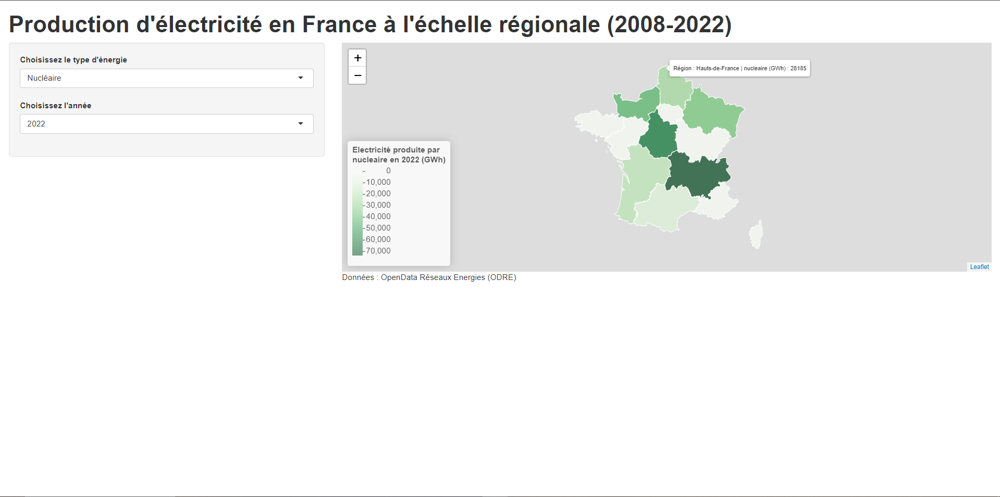

# Projet de Visualisation de Données sur la Production d'Électricité en France

Ce projet consiste en la visualisation de données sur la production d'électricité en France, en utilisant une carte de la repartition des sites de productions électriques générée avec le package R "leaflet" et une application web Shiny.

## Structure du Projet

Le projet est composé de deux fichiers principaux :

1. **leaflet_map.R** : Ce script R permet de générer une carte représentant la répartition des installations électriques en France par commune. Les données sont agrégées au niveau des communes (IRIS) et sont affichées sur une carte basée sur le package leaflet. Cette carte est sauvegardée en HTML avec des marqueurs circulaires pour indiquer les installations électriques.

2. **shiny_app.R** : Ce script R permet de créer une application web Shiny pour visualiser la production d'électricité en France à l'échelle régionale. L'application permet de sélectionner le type d'énergie (nucléaire, thermique, hydraulique, éolienne, solaire, bioénergie) ainsi que l'année souhaitée (2008 - 2022) pour afficher la répartition de la production d'électricité par région sur une carte interactive.

